# Titi WorldEdit — application de bureau

Éditeur de mondes Minecraft pour Windows : reprend le moteur WorldEdit du site
`titisite`, sans ses plafonds de VPS, avec une vraie interface d'atelier.

Ce document se remplit au fil des phases. Il consigne aussi les **écarts
assumés** avec la spécification d'origine — les endroits où on a fait
différemment, et pourquoi.

---

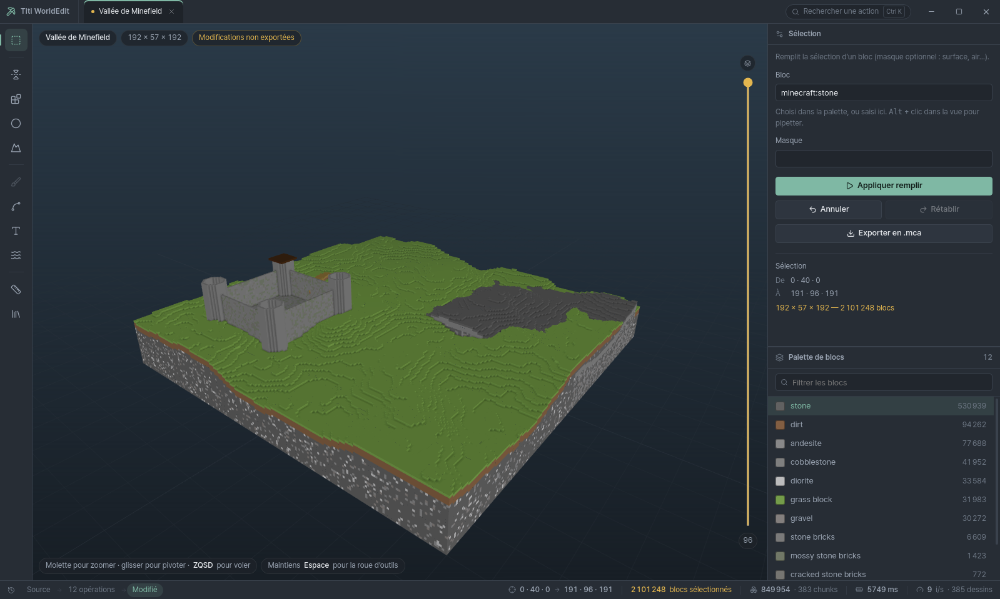

*Capture réelle de l'application : un build de 850 000 blocs généré par le
moteur lui-même (`npm run demo`), maillé par chunk avec occlusion ambiante.*

## Où vit quoi

```
ExeWorldEdit/
├─ packages/we-engine/     le moteur, sans dépendance à un serveur
│  ├─ src/anvil/           lecture/écriture .mca lossless
│  ├─ src/worldedit/       opérations, états de blocs, formats d'échange
│  ├─ src/storage/         StorageAdapter + implémentation fichiers
│  ├─ src/staging/         orchestration non destructive
│  ├─ assets/fonts/        Unifont (rendu de texte sans police système)
│  ├─ test/                129 tests
│  └─ bench/               mesures de performance (phase 1.1)
└─ apps/desktop/
   ├─ src/main/            processus principal : fenêtre, protocole app://, IPC
   ├─ src/preload/         pont d'API (CommonJS — obligatoire en sandbox)
   ├─ src/engine/          le moteur dans son utilityProcess
   ├─ src/renderer/        React + three.js
   ├─ assets/fonts/        Pretendard (latin + hangeul, OFL)
   ├─ test/                14 tests du mailleur
   └─ scripts/make-demo.js build de démonstration, via le vrai moteur
```

## Les trois processus

| | Rôle | Ce qu'il n'a PAS le droit de faire |
|---|---|---|
| **Principal** | Fenêtre, dialogues système, protocole `app://`, relais IPC | Calculer quoi que ce soit sur un build |
| **Moteur** (`utilityProcess`) | Source de vérité : seul à lire et écrire les régions | Parler à l'utilisateur, choisir un chemin de fichier |
| **Renderer** | Interface et viewport | Toucher au disque, invoquer autre chose que la liste blanche du preload |

Le renderer tourne en `contextIsolation: true`, `nodeIntegration: false`,
`sandbox: true`. Il ne dispose que des méthodes énumérées dans
`src/preload/index.cjs` : compromis par une dépendance, il ne peut rien faire
d'autre. Une politique de sécurité de contenu interdit en plus toute ressource
qui ne vient pas de `app://` — aucun CDN, aucune police distante, aucune requête
réseau.

`titisite` n'est **pas** modifié par ce dépôt. Le site continue de tourner sur sa
propre copie du moteur. Les deux vont donc diverger dès la phase 1 — c'est un
choix, pas un oubli : voir « Rapport au site » plus bas.

---

## Architecture visée

```
┌────────────── Renderer (React) ──────────────┐
│ UI · viewport three.js                        │
│  ├─ worker d'édition : chunks près du curseur │
│  └─ workers de maillage : greedy + AO         │
└───────────────▲──────────────────────────────┘
                │ MessagePort (buffers transférés)
┌───────────────┴──────────────────────────────┐
│ Engine (utilityProcess, source de vérité)     │
│ RegionStore · staging · undo · export         │
│  └─ pool worker_threads (zlib/NBT, ops lourdes)│
└───────────────────────────────────────────────┘
```

Trois corrections apportées à l'architecture proposée à l'origine :

**`SharedArrayBuffer` n'est pas un prérequis.** Le mailleur a besoin des chunks
voisins pour l'occlusion ambiante et la suppression des faces cachées, mais la
manière habituelle de le lui donner est un bloc **paddé 18³ d'identifiants**
envoyé en `ArrayBuffer` transféré : zéro copie, et surtout aucune isolation
cross-origin à mettre en place. COOP/COEP sur `app://` reste possible et
fonctionne (il faut `registerSchemesAsPrivileged` avant `app.ready`), mais ça
complique tout le reste du chargement. On garde SAB comme optimisation
activable si le profilage la réclame, pas comme fondation.

**Les anciens identifiants de l'undo viennent de l'engine, jamais du renderer.**
Le chemin rapide des brushs veut que le renderer applique localement puis envoie
des deltas creux. S'il fournissait aussi les anciens identifiants et qu'il a
désynchronisé, l'undo réécrirait des valeurs fausses, sans que rien ne le
signale. Le renderer n'envoie donc que des paires `(index, nouvelID)` ; l'engine,
qui est la source de vérité, capture l'ancienne valeur au moment où il applique.

**Le greedy meshing ne couvre pas tout.** Il ne s'applique qu'aux cubes pleins
opaques. Escaliers, dalles et les quarts de bloc `minefield:*` doivent être émis
en géométrie de modèle cuite, ajoutée au même tampon de chunk, plus une passe
transparente séparée pour l'eau et le verre. C'est le gros du travail de
maillage et ça ne figurait pas dans la spécification d'origine.

---

## Le StorageAdapter

C'est la seule frontière entre le moteur et son hôte. Le moteur ne sait pas s'il
tourne dans un serveur Express avec SQLite ou dans un processus Electron.

Ce qui passe par l'adapter — parce que ça **diffère** entre les deux :

| | Site (SQLite + uploads) | Desktop (`FsAdapter`) |
|---|---|---|
| Projets | table `minecraft_blueprints` | `projects/<id>/project.json` |
| Fichier source | `uploads/<uuid>` | `projects/<id>/source/` |
| Journal | table `worldedit_audit` | `audit.jsonl` |
| Bibliothèque | table + `uploads/` | `library/<scope>.json` + blobs |
| Dossier de travail | `uploads/worldedit/<id>/` | `projects/<id>/staging/` |

Ce qui **ne** passe **pas** par l'adapter, volontairement : la mécanique des
snapshots undo, des fichiers de région et de l'aperçu. Les deux hôtes ont un vrai
système de fichiers ; l'adapter se contente de nommer un dossier (`stagingDir`)
que le moteur possède ensuite entièrement. Abstraire aussi cette mécanique aurait
signifié réécrire mille lignes de code testé pour n'en tirer aucune souplesse.

Les tests de l'adapter sont écrits comme une **suite de contrat** paramétrée par
une fabrique : un futur adapter SQLite s'y branche et doit passer les mêmes
assertions.

### Arborescence du poste local

```
%APPDATA%/TitiWorldEdit/         (macOS et Linux : emplacements conventionnels)
├─ projects/<id>/
│  ├─ project.json               métadonnées, écrites en atomique
│  ├─ source/<fichier>           le .mca / .zip importé, jamais modifié
│  ├─ staging/
│  │  ├─ regions/r.X.Z.mca       la copie de travail
│  │  ├─ undo/<n>/ redo/<n>/     snapshots des régions touchées
│  │  └─ preview.json.gz
│  └─ audit.jsonl
└─ library/
   ├─ <scope>.json
   └─ blobs/<uuid>.we.gz
```

Le journal est en JSON Lines : une opération ajoute une ligne en O(1) sans relire
le fichier, et un journal coupé par un crash reste lisible jusqu'à sa dernière
ligne complète. `project.json` s'écrit par fichier temporaire puis renommage :
un crash au milieu laisse l'ancien intact plutôt qu'un JSON tronqué.

---

## Le contrat non destructif

Inchangé depuis le site, et c'est l'invariant central :

1. On ne touche **jamais** au fichier source. À la première opération, il est
   déplié en copie de staging.
2. Chaque opération commence par un **snapshot** des régions qu'elle va toucher.
   C'est ce qui donne l'undo, et c'est pris avant la moindre écriture.
3. Les chunks non modifiés sont **réémis octet pour octet**. Le round-trip Anvil
   est lossless, vérifié par des tests qui relisent le fichier produit avec un
   décodeur indépendant.
4. Réinitialiser jette la copie de travail et repart de la source.

---

## Écrire dans une vraie save

« Appliquer au monde » est la seule action irréversible de l'application. Elle
suit trois garde-fous, **dans cet ordre** :

1. **Refuser si Minecraft tient le monde.** Le jeu garde un verrou exclusif sur
   `session.lock` tant qu'un monde est chargé, et écrire dans un monde chargé le
   corrompt.
2. **Sauvegarder en zip horodaté** les régions qui vont être réécrites — celles
   de blocs *et* celles d'entités. Seulement celles-là : archiver un monde entier
   à chaque application coûterait des gigaoctets pour rien.
3. **Écrire.**

L'ordre n'est pas négociable, et un test le vérifie explicitement : il relit
l'archive et exige d'y trouver l'état d'AVANT. Une sauvegarde prise après la
première écriture ne sauvegarde plus rien.

### Le verrou ne se détecte pas partout pareil

| | Nature du verrou | Détection |
|---|---|---|
| **Windows** | obligatoire (système) | fiable — ouvrir `session.lock` en écriture échoue |
| **Linux, macOS** | consultatif (POSIX) | **impossible** — l'ouverture réussit même monde chargé |

`probeWorldLock` renvoie donc `{ locked, reliable }` plutôt qu'un simple
booléen. Là où la détection n'est pas fiable, l'application ne fait pas semblant
de savoir : la confirmation dit franchement qu'elle ne peut pas vérifier et
demande de fermer le jeu. Windows étant la plateforme visée, la garde est
effective là où elle compte — mais mentir sur ce qu'on sait ailleurs aurait été
pire que de l'avouer.

### Ce qui s'ouvre

| Entrée | Devient |
|---|---|
| `.mca` | un projet, région seule |
| `.zip` d'un dossier `region/` | un projet, toutes ses régions |
| dossier de save (`level.dat` + `region/`) | sa **carte** — on choisit ensuite la zone (voir plus bas) ; le projet garde la save attachée, seul cas où « Appliquer au monde » existe |
| dossier `region/` isolé | sa carte aussi, sans save attachée |
| `.schem` (Sponge), `.litematic` | un projet : régions vierges à la taille du schematic, puis tamponnage |

Un chemin peut aussi arriver **au lancement** (`titi-worldedit.exe "…/saves/Monde"`,
« ouvrir avec », un fichier lâché sur l'icône) : il suit le même chemin qu'un
glisser-déposer, sans traitement à part.

### Ouvrir un monde : la carte d'abord, la zone ensuite

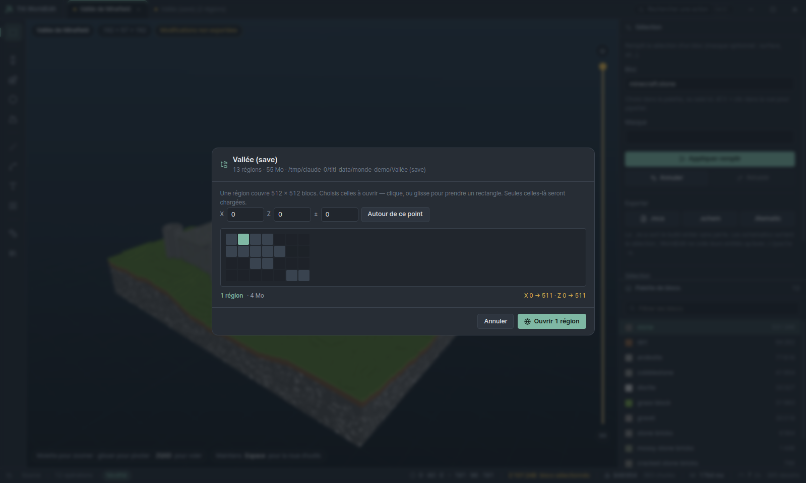

Une région couvre 512 × 512 blocs. Un monde joué quelques mois en compte
facilement plusieurs centaines, soit des dizaines de gigaoctets : **tout charger
n'est pas lent, c'est impossible**. L'ouverture se fait donc en deux temps.

1. `worldOverview` lit les seuls noms et tailles de fichiers — aucun décodage,
   instantané même sur un monde énorme — et rend la carte de ce qui existe.
2. On désigne les régions voulues : au clic, au glissé pour un rectangle, ou en
   entrant des coordonnées du F3 avec un rayon. `regionsForBBox` traduit une
   boîte en coordonnées monde en indices de région, et seules celles-là sont
   matérialisées dans le staging.

Le piège de cette traduction, ce sont les **coordonnées négatives** : le bloc
`-1` appartient à la région `-1`, pas à la région `0`. Une division entière naïve
chargerait la mauvaise moitié du monde, en silence. Des tests dédiés couvrent
l'origine et ses quatre quadrants.

Une zone qui déborde sur du terrain jamais généré est normale : on charge ce
qu'il y a et on annonce combien manquait, plutôt que d'échouer sur du vide.

`loadMoreRegions` étend ensuite un projet ouvert. Les régions déjà chargées ne
sont **pas** rechargées — le travail en cours dessus serait sinon écrasé par le
contenu du disque.

Un schematic n'a ni chunks ni coordonnées absolues. Plutôt que d'en faire un cas
particulier que tout le moteur devrait connaître, on lui fabrique des régions et
on l'y tamponne : le résultat est un build ordinaire, éditable et annulable
comme les autres. Son offset d'origine est respecté, si bien que le recoller
sans décalage le remet exactement où il a été pris.

Le glisser-déposer passe par le même point d'entrée que les dialogues : c'est
l'extension qui choisit la porte. Le renderer ne lit jamais le fichier — il n'en
transmet que le chemin.

---

## Réglages et mode performance

Les réglages vivent dans `settings.json`, à la racine de l'espace de données, et
passent par le `StorageAdapter` (`readSettings` / `writeSettings`) comme tout le
reste. Ils ne sont **pas** dans le `localStorage` du renderer : celui-ci est
effacé par un vidage de cache, et un réglage qui disparaît à chaque mise à jour
n'est pas un réglage.

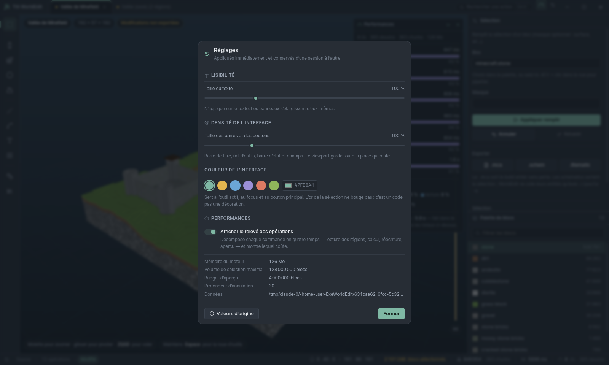

Quatre réglages, appliqués **à la frappe** et non à la validation — un réglage
d'apparence qu'on ne voit qu'après avoir fermé la fenêtre se règle à l'aveugle :

| Réglage | Effet | Bornes |
|---|---|---|
| `textScale` | multiplie `--t-micro/small/body/title` | 0,8 → 1,6 |
| `uiScale` | multiplie la densité de la coquille (barres, rail, boutons, champs) | 0,85 → 1,5 |
| `accent` | `--accent` et ses quatre nuances dérivées | tout `#RRGGBB` |
| `perf` | affiche le relevé des opérations | oui / non |
| `limits` | plafonds du moteur (voir plus bas) | par plafond |

### Tout passe par des variables CSS

`renderer/theme.js` transforme les réglages en une poignée de variables posées
sur `:root` ; la feuille de style entière suit. Aucun composant ne lit les
réglages pour se dimensionner lui-même, sans quoi la moitié de l'interface
obéirait et l'autre non.

Ce module est **pur** en dehors de `applyTheme` — donc testé sans navigateur
(`apps/desktop/test/theme.test.js`, 11 tests). Deux choses s'y vérifient qu'on
ne voit pas à l'œil :

- **`inkOn(accent)`** choisit le texte du bouton principal par contraste WCAG.
  Sans ce calcul, un accent sombre choisi par l'utilisateur donne un bouton noir
  sur noir : le réglage casserait l'interface au lieu de la personnaliser. Le
  test exige 4,5:1 sur chaque accent proposé.
- **`tokens.css` et le module ne doivent pas diverger.** Le premier sert au tout
  premier rendu, avant que le moteur ait répondu ; le second sert ensuite. Un
  test compare les deux à l'échelle 1 — et a trouvé l'écart dès sa première
  exécution : `--accent-dim` valait `#5E8D7E` en dur contre `#5B8476` calculé.
  L'interface sautait au démarrage, pendant une image.

L'or de la sélection (`--select`) n'est **pas** réglable : c'est un code de
lecture partagé par le viewport, la pastille d'onglet et la barre d'état, pas
une décoration.

### Les plafonds du moteur

`DEFAULT_LIMITS` (`staging/geometry.js`) n'était réglable que dans le code. Les
cinq plafonds qui dépendent de la machine sont maintenant dans le panneau :
volume de sélection, budget d'aperçu, extraction de zone, baguette magique,
profondeur d'annulation.

**`worldMinY` et `worldMaxY` n'y sont pas.** Ce ne sont pas des préférences mais
la hauteur du monde Minecraft : les rendre réglables laisserait écrire hors du
monde et produirait des régions qu'aucun jeu ne relirait. `normalizeLimits` les
remet depuis `DEFAULT_LIMITS` quoi qu'on lui passe — un `settings.json` bricolé
à la main ne peut pas les déplacer, et un test l'exige.

Trois décisions valent d'être notées :

- **Le bornage est à la frontière des réglages, pas dans le constructeur.**
  `createStaging(adapter, options)` reçoit ses plafonds du CODE : un test qui
  demande un budget d'aperçu de dix blocs pour vérifier la troncature doit
  obtenir dix. C'est `setLimits` — l'entrée humaine — qui borne. Les tests
  existants ont attrapé l'erreur inverse dès le premier jet.
- **Un plafond prend effet tout de suite.** `limits` est muté en place et tous
  les appels lisent `limits.x` au moment de l'appel : pas de staging à
  reconstruire, donc pas de cache d'aperçu perdu. Le relire au prochain
  démarrage ferait croire que le réglage n'a pas marché.
- **Les BORNES viennent du moteur**, transportées par `getSettings`. L'interface
  génère ses champs depuis elles, comme l'inspecteur génère les siens depuis les
  descripteurs d'opérations. Les redéclarer côté renderer les ferait diverger —
  et importerait le moteur entier dans le bundle.

Le champ réaffiche toujours la valeur **retenue par le moteur**, jamais celle
qui a été tapée : saisir dix fois le plafond ne doit pas laisser croire que
c'est passé.

### Le relevé des opérations

Le moteur chronomètre chaque opération en quatre temps (`phaseTimer`,
`staging/geometry.js`), exactement les mêmes que ceux annoncés par la barre de
progression :

| Phase | Ce qu'elle couvre |
|---|---|
| `load` | décoder les régions touchées, warmup du `RegionStore` |
| `apply` | l'opération elle-même |
| `commit` | instantané d'annulation + réécriture des régions |
| `preview` | redériver l'aperçu 3D |
| `reste` | ce que les quatre n'ont pas couvert (validation, journal) |

Le relevé est joint au résultat de l'opération **et consigné au journal**
(`AuditEntry.timings`), donc consultable après coup : ouvrir un projet recharge
son historique de mesures depuis `audit.jsonl`. Ce que le panneau montre a donc
réellement été mesuré dans le moteur — ce n'est pas un chronomètre tenu par
l'interface, qui compterait aussi les allers-retours entre processus.

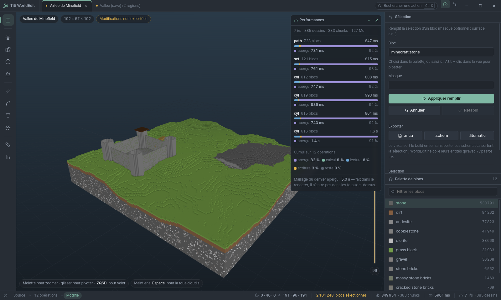

Chaque ligne porte une barre **à l'échelle** des durées, et la phase dominante
est nommée en clair : la déduire de la largeur d'un segment n'est pas la donner.
Le cumul en bas répond à l'autre question — une commande lente une fois est un
accident, la même phase lente dix fois est une cible.

### Ce que le relevé a montré tout de suite

Sur le build de démonstration (192 × 192, 850 000 blocs, 12 opérations), le
premier cumul affiché était sans appel :

```
aperçu 82 %  ·  calcul 9 %  ·  lecture 6 %  ·  écriture 3 %  ·  reste 0 %
```

**82 % du temps du moteur partait à régénérer l'aperçu.** Poser 121 blocs avec
`set` coûtait 815 ms, dont 761 ms d'aperçu.

---

## Rendre l'aperçu incrémental

La piste évidente — « ne pas afficher ce qu'on ne voit pas » — a été mesurée
avant d'être suivie, et elle ne menait pas là où on croyait.

### Les faces sont déjà culées

Le mailleur n'émet une face qu'entre un plein et un vide. Sur le build de
démonstration : **849 954 blocs → 52 362 quads**, là où six faces par bloc en
feraient 5,1 millions. Il n'y a rien à gagner de ce côté.

### Les blocs enterrés, eux, sont bien du poids mort — mais on ne peut pas les jeter

| | blocs | part |
|---|---|---|
| enterrés (six voisins pleins) | 751 880 | **88,5 %** |
| visibles | 98 074 | 11,5 % |

Sauf qu'en les retirant, le mailleur voit de l'air à l'intérieur et dessine la
coque intérieure : **52 362 → 98 345 quads, +87,8 %**. On diviserait les données
par neuf pour doubler les triangles. Et le curseur de couche étant un plan de
coupe three.js et non un filtre, trancher dans une coque creuse montrerait un
build vide au milieu.

L'**occupation** de ces blocs porte du sens même quand leur **identité** n'en
porte pas : c'est elle qui dit au mailleur de ne pas dessiner. Une extraction
« surface seule » demanderait donc une sentinelle « plein, non listé » connue du
mailleur — ce n'est pas fait, et ce n'était de toute façon pas le vrai coupable.

### Le vrai coupable : la sérialisation, puis le parcours

Décomposition de la phase `preview` (~1 s) :

| | avant |
|---|---|
| **gzip** | **457 ms** |
| `deriveSparse` (parcours de l'emprise) | 338 ms |
| warmup | 101–198 ms |
| `JSON.stringify` | 77 ms |

La moitié partait à compresser un **fichier de cache local**, au niveau par
défaut. Le niveau 1 coûte 67 ms pour 350 ko de plus : 390 ms rendus sur une
ligne.

Le reste tient au fait que l'aperçu était redérivé **en entier** après chaque
opération. Or `applyOperation` connaît déjà la boîte qu'il a touchée — c'est
celle dont il prend l'instantané d'annulation, `sel ∪ bounds`. `splicePreview`
(`src/staging/preview.js`, pur) redérive cette seule boîte et la recolle sur
l'aperçu précédent.

Ce n'est pas un choix de confort : **si une opération écrivait hors de cette
boîte, l'annulation serait déjà fausse**. Le recollage est donc exactement aussi
fiable que l'undo, ni plus ni moins. Il renvoie `null` — et l'appelant redérive
tout — dès qu'il ne peut rien garantir : aperçu source tronqué, ou budget
dépassé en cours de route.

### Deux pièges de mesure en chemin

Le premier jet n'a rendu que 25 %. La mesure a dit pourquoi, deux fois :

1. **La boucle chaude refabriquait une clé texte de palette par bloc** —
   850 000 concaténations et autant de recherches dans une `Map`. Une table de
   correspondance calculée une fois par palette ramène la boucle à de l'entier :
   317 → 184 ms.
2. **Repasser d'un `Int32Array` à un tableau JS coûtait 160 ms.** L'aperçu finit
   en JSON, donc le tampon doit être un `Array` ordinaire — prédimensionné et
   rempli par index, c'est 16 ms. Dix fois moins, pour un détail de type.

Et `readPreview` relisait à chaque opération (gunzip 48 ms + `JSON.parse`
161 ms) un objet qu'on venait soi-même d'écrire : une case de cache en mémoire,
posée dans `writePreview`/`readPreview` pour ne pas pouvoir se désynchroniser,
supprime ces 209 ms.

### Résultat

| phase | avant | après | |
|---|---|---|---|
| lecture | 732 ms | 634 ms | −13 % |
| calcul | 1 233 ms | 1 130 ms | −8 % |
| écriture | 427 ms | 379 ms | −11 % |
| **aperçu** | **10 879 ms** | **2 825 ms** | **−74 %** |
| **total** | **13 276 ms** | **4 968 ms** | **−63 %** |

L'aperçu est **3,9 × plus rapide** et retombe de 82 % à 57 % du temps moteur.
Sur les petites opérations, celles qu'on enchaîne : `set` de 121 blocs passe de
**815 ms à 239 ms**, `path` de 847 à 243 ms.

Le plancher restant est structurel : on resérialise l'aperçu entier à chaque
opération (`JSON.stringify` 46 ms + gzip 76 ms + recollage ~40 ms), quel que
soit le nombre de blocs changés. Descendre plus bas demande de changer le
FORMAT de l'aperçu — binaire, ou découpé par chunk — ce qui touche aussi le
renderer. Phase 1.2 également.

---

## Le chemin chaud du `RegionStore`

Le bench annonçait un écart de 7× entre lecture et écriture : `setBlock` à
1,1 M/s contre `getBlock` à 7,8 M/s. Le profileur a dit exactement pourquoi.

| poste | part du temps d'écriture |
|---|---|
| `propsKey` (clé texte des états) | 22 % |
| le rappel du `findIndex` sur la palette | 14 % |
| `_chunkRec` + `_regionAt` (clés texte de chunk) | 12 % |
| ramasse-miettes (les chaînes jetées ci-dessus) | 5 % |

`setBlock` **refabriquait la clé texte de chaque entrée de palette, à chaque
bloc** : pour une palette de dix entrées, onze allocations de chaîne par bloc
écrit.

Trois corrections, dans cet ordre de gain :

1. **Index de palette en `Map`**, construit une fois par section et tenu à jour
   à l'ajout. Une clé fabriquée et une recherche par bloc, au lieu de 1 + N.
   `grid.palette` n'est modifiée qu'à un seul endroit, ce qui rend l'index
   impossible à désynchroniser tant que ça reste vrai.
2. **Mémo d'une case sur la section résolue.** Les opérations parcourent en
   YZX, donc seize blocs consécutifs tombent dans la même section : une seule
   case suffit à supprimer `_chunkRec` et `_regionAt` du profil. Le mémo profite
   aussi à `getBlock`, qui n'était pourtant pas la cible.
3. **Un bloc sans état rend son nom comme clé**, sans concaténation. C'est
   l'écrasante majorité des blocs d'un build. `{}` et `null` rendent la même
   clé, sinon un bloc décrit des deux façons occuperait deux entrées de palette.

### Résultat

| scénario | référence | après | |
|---|---|---|---|
| `store-setblock` | 983 ms | 284 ms | **× 3,5** |
| `store-getblock` | 135 ms | 48 ms | **× 2,8** |
| `set-10M` | 6 590 ms | 984 ms | **× 6,7** |
| `replace` | 2 092 ms | 326 ms | **× 6,4** |
| `naturalize` | 2 254 ms | 625 ms | **× 3,6** |
| `mirror-rotate` | 9 312 ms | 5 190 ms | **× 1,8** |
| `mix` | 2 773 ms | 2 148 ms | × 1,3 |

`set-10M` passe de 1,7 à 10,7 M/s. `mix` gagne le moins : son coût est ailleurs
(le tirage pondéré lui-même), ce que le profil confirmera si on y revient.

Ce qui reste : `getBlock` alloue toujours un objet `{ Name, Properties }` par
appel. Le supprimer demanderait une interface à identifiants entiers, donc de
toucher `transform.js` entier — un autre chantier.

---

## Le format de l'aperçu

L'aperçu était du JSON gzippé. Mesuré sur 850 000 blocs, à **chaque** opération :

| | avant |
|---|---|
| `JSON.parse` (relecture) | 161 ms |
| gzip (écriture) | 76 ms |
| gunzip (relecture) | 48 ms |
| `JSON.stringify` (écriture) | 46 ms |

Soit ~330 ms de sérialisation par commande, quel que soit le nombre de blocs
réellement changés — un plancher que le recollage incrémental ne pouvait pas
franchir.

`previewCodec.js` écrit les mêmes données en binaire, **sans compression** :
~10 ms à l'écriture, ~20 ms à la relecture, pour 5,1 Mo au lieu de 2,0 Mo.
C'est le même arbitrage que le niveau de gzip qui l'a précédé : un aperçu est
un fichier de cache, régénérable à volonté et jamais partagé. On l'optimise
pour le temps, pas pour la place.

### Ce que le format garantit

- **Deux modes.** `linear` (6 o/bloc) écrit un index de case en Uint32 ;
  utilisable tant que le volume de l'emprise tient dans 32 bits, soit une boîte
  de 1625³. Au-delà, repli `triple` (14 o/bloc) avec x, y, z séparés. Sans ce
  repli, une très grande emprise ferait déborder l'index en silence.
- **Palette large.** Au-delà de 65 535 entrées, les index passent en Uint32 :
  tronquer en Uint16 transformerait un bloc en un autre, sans erreur.
- **Corps aligné sur 4 octets.** Une vue `Uint32Array` sur un décalage non
  aligné lève ; le bourrage de l'en-tête est le seul moyen de le garantir.
- **Le format se reconnaît à ses octets, pas à son nom.** Un projet ouvert avant
  la phase 1.2 a un `preview.json.gz` : il se relit encore, et la première
  écriture le convertit puis le retire. Deux fichiers pour la même chose
  finiraient par diverger — un test l'exige.

### Où en est le moteur

Cumul des douze opérations du build de démonstration, depuis le début de la
phase 1.2 :

| phase | départ | aujourd'hui | |
|---|---|---|---|
| lecture des régions | 732 ms | 693 ms | −5 % |
| calcul | 1 233 ms | 337 ms | −73 % |
| écriture | 427 ms | 365 ms | −15 % |
| **aperçu** | **10 879 ms** | **976 ms** | **× 11,1** |
| **total** | **13 276 ms** | **2 372 ms** | **−82 %** |

L'aperçu retombe de 82 % à 41 % du temps moteur. Les petites opérations, celles
qu'on enchaîne, passent de ~815 ms à ~90 ms.

Le relevé désigne maintenant une autre cible : **la lecture des régions est
devenue le premier poste** (29 % du cumul). C'est le décodage Anvil, déjà
optimisé × 4,2 à la phase 1.2 — la suite est le parallélisme.

---

## Le pool de fils

Le point de départ était « `terrain-1024` prend 37,6 s sur un seul fil ». Deux
mesures ont redressé le plan avant d'écrire une ligne de pool.

### La première a supprimé les deux tiers du problème

Après le travail sur le `RegionStore`, `terrain-1024` était déjà tombé à
**10,1 s**. Et le profil ne montrait plus de coût dominant en série : le temps
s'était réparti entre le bruit, les recherches de section, l'écriture. Le seul
gros poste restant venait de `getBlock`, qui **allouait un objet par appel** —
34 % du temps, plus 5 % de ramasse-miettes derrière.

Deux sondes sans allocation (`isAirAt`, `matchesAt`) l'ont fait disparaître du
profil. Elles sont OPTIONNELLES : un volume qui ne les implémente pas retombe
sur `getBlock`, comme pour `getBiome`. `naturalize` y a gagné 21 %.

### La seconde a décidé de la découpe

L'idée naturelle — un fil par chunk à décoder — ne marche pas, et ça se mesure
en trois lignes :

```
décodage de 128 chunks    60 ms
transfert des arbres NBT  65 ms
```

Le processus principal a besoin de l'arbre NBT pour réécrire la région sans
perte. **Le transférer coûte plus cher que le décoder** (rapport 1,08) : un fil
qui rendrait des chunks décodés ferait perdre du temps, pas en gagner.

Ce qui se transfère sans copie, c'est un `ArrayBuffer`. D'où la seule découpe
qui paie : **un fil possède une région entière**, du décodage au réencodage, et
ne rend que des octets.

### Ce que ça interdit

Découper par région sans bordure n'est juste que pour les opérations
**colonne-locales** : celles dont chaque case ne dépend que de son propre
(x, z).

| | |
|---|---|
| `terrain`, `naturalize` | colonne-locales — parallélisées |
| `smooth`, `erode`, `dilate` | lisent un voisin : verraient de l'air au bord de leur région, et produiraient une couture invisible |
| `mirror`, `rotate`, `translate`, `stack`, `scale` | lisent ailleurs dans la sélection : découpées, elles n'ont pas de sens |

`COLUMN_LOCAL_OPS` est volontairement courte, et un test la garde telle quelle.

Deux détails qui rendraient le résultat faux s'ils étaient omis :

- **la découpe est en X/Z, jamais en Y.** La hauteur est ce que l'utilisateur a
  demandé, pas une propriété de la région ; la rogner changerait le relief que
  chaque fil calcule ;
- **le garde-fou compte les régions que la SÉLECTION traverse**, pas les
  fichiers du projet. Un build de treize régions dont on n'édite qu'un coin ne
  donne du travail qu'à un seul fil : le paralléliser coûterait le démarrage du
  pool pour rien. Seuils : deux régions et un million de cases.

### Résultat

Terrain « collines » sur 1536 × 1536 (neuf régions, 65,4 M de blocs), pool de
trois fils sur quatre cœurs :

| | |
|---|---|
| série | 41 695 ms |
| parallèle | 17 384 ms |
| | **× 2,40** |

Le nombre de blocs changés est identique au bloc près. Le test qui compte
compare le résultat parallèle au résultat série **case par case**, avec une
sélection à cheval sur la frontière x = 512 : c'est exactement là qu'une couture
apparaîtrait, et elle ne se verrait pas autrement dans un build de plusieurs
millions de blocs.

Le bench mesure toujours le chemin SÉRIE (`terrain-1024` appelle `opTerrain`
directement) : c'est voulu, il compare le moteur à lui-même. Le gain du pool se
mesure au niveau d'`applyOperation`.

---

## Les block entities suivent leurs blocs

Le contenu d'un coffre, le texte d'un panneau, le motif d'une bannière : rien de
tout ça n'est dans la grille de blocs. C'est une liste à part dans le chunk,
dont chaque entrée porte ses coordonnées MONDE.

Deux pertes en découlaient, et aucune ne se voyait avant d'ouvrir le monde en
jeu :

- **l'export avec décalage** reconstruisait le build depuis `deriveSparse`, qui
  ne porte que des blocs. Les coffres arrivaient vides, les panneaux muets, les
  biomes remis à zéro ;
- **les opérations qui déplacent des blocs** (miroir, rotation, translation,
  stack, copier-coller, échelle) laissaient les entrées sur place. Faire pivoter
  un build déplaçait les coffres et abandonnait leur contenu à l'ancienne
  position.

### Le bon endroit était la `Schematic`

Toutes les transformations passent par le même tuyau : `readSelection` →
transformation → `stampSchematic`. Porter les entrées **dans la structure
`Schematic`** plutôt que dans chaque opération, c'est ce qui les fait toutes
marcher d'un coup — y compris celles qu'on écrira plus tard.

L'entrée est recopiée **telle quelle**, seules ses coordonnées changent. On ne
sait pas ce qu'il y a dedans et on n'a pas à le savoir : c'est la seule façon de
ne rien perdre d'une version de Minecraft qu'on ne connaît pas encore.

### Trois règles qui évitent des fantômes

- **Une case ne porte qu'une entrée.** Poser sur une case occupée remplace :
  deux block entities au même endroit n'ont pas de sens, et Minecraft n'en
  lirait qu'une, laquelle étant indéfini.
- **Écrire un bloc sans entrée en retire une.** Un coffre remplacé par de la
  pierre qui garderait son contenu deviendrait un coffre fantôme, réapparaissant
  sous le bloc suivant. `stampSchematic` en mode `overwrite` et `fillSelection`
  nettoient la case.
- **La capacité est optionnelle sur le volume**, comme `getBiome` : `RegionStore`
  la porte, `MemoryVolume` non, et les opérations n'ont pas à savoir lequel elles
  manipulent. `MaskedVolume` la relaie en respectant son masque — lecture libre,
  écriture masquée, exactement comme pour les blocs.

L'export décalé emporte désormais aussi les **biomes**, et annonce ce qu'il a
transporté (`carried`) : un export silencieux dont on découvre plus tard ce
qu'il a gardé ne vaut rien.

Ce qui reste : les **entités mobiles** (`entities/r.X.Z.mca`) — villageois,
cadres, armor stands. Elles vivent dans un autre fichier et ne sont pas encore
touchées.

---

## Portabilité Windows et dépendances

### `npm test` ne testait rien sous Windows

Le script était `node --test 'test/*.test.js'`. Sous bash, le shell retire les
apostrophes et développe le motif. Sous PowerShell et cmd, **rien de tout ça** :
Node recevait une chaîne contenant les apostrophes et cherchait un fichier
littéralement nommé `'test/*.test.js'`. Il n'en trouvait aucun, annonçait
`tests 0`, et **sortait en succès**.

C'est le pire genre de défaut : la vérification passait au vert en ne
vérifiant rien, sur la plateforme même que l'application vise.

Le correctif est un guillemet : `node --test "test/*.test.js"`. Les deux shells
retirent les guillemets doubles, Node reçoit le motif brut, et **Node 22 le
développe lui-même**. La même commande marche des deux côtés.

### Dépendances : ce qui compte et ce qui ne compte pas

`npm audit` annonçait 14 vulnérabilités (13 hautes, 1 critique). Elles se
séparent en deux groupes qu'il ne faut pas confondre :

| | |
|---|---|
| `electron` | **embarqué dans l'exe**. La version 33 accusait des dizaines de correctifs manquants, dont plusieurs visent notre architecture : contournement de l'isolation de contexte via `Function.prototype.bind`, `contextBridge` qui honore les setters de prototype, et lecture inter-origine sur un protocole personnalisé `supportFetchAPI` sans `corsEnabled` — c'est exactement notre `app://`. |
| `tar`, `extract-zip`, `electron-builder` | build seulement. Ils tournent pendant `npm run dist` et ne sont jamais livrés. |

Electron 33 → 44 et electron-builder 25 → 26 : **0 vulnérabilité**, et 174
paquets en moins dans l'arbre. L'application a été rebâtie et lancée sans écran
pour vérifier : même rendu, mêmes 385 appels de dessin, même palette. Aucune
API cassée — `utilityProcess`, `protocol.handle` et `titleBarOverlay` sont
stables depuis longtemps.

Le `lint` est aussi revenu à zéro problème : deux directives `eslint-disable` en
ligne faisaient doublon avec celle en tête de `save.js`, et `make-demo.js` a
reçu la sienne, motivée. Un avertissement qui traîne en cache un vrai.

---

## Empaqueter : trois défauts que la première tentative révèle

La configuration `electron-builder.yml` existait mais n'avait jamais tourné. La
lancer a suffi à trouver trois choses.

### 1. Une plage de version bloque tout

```
⨯ Electron version "^44.3.0" is a range, not a fixed version.
```

electron-builder télécharge les binaires d'une release PRÉCISE ; un accent
circonflexe ne se résout pas. La version doit être épinglée à l'exact
(`"electron": "44.3.0"`). C'est la première erreur qu'aurait vue quiconque lance
`npm run dist`.

### 2. `sharp` n'a jamais été une dépendance de ce projet

`asarUnpack` sortait `sharp/**` et `@img/**` de l'archive, avec un long
commentaire expliquant pourquoi c'est indispensable. Sauf que ce projet n'a
aucune dépendance native : la configuration venait d'ailleurs. Une consigne
fausse est pire qu'une absence de consigne — elle se recopie.

Seule la police Unifont doit réellement sortir de l'asar : le moteur de rendu de
texte la lit par chemin avec `fs.readFileSync`.

### 3. Le renderer était livré DEUX FOIS

`react`, `three`, `@radix-ui/*`, `cmdk`, `zustand` étaient déclarés en
`dependencies`. Or electron-builder embarque **toujours** les dépendances de
production, quels que soient les motifs `files:`. Et Vite les avait déjà
empaquetées dans `dist/renderer`.

Résultat : les mêmes bibliothèques dans le bundle **et** en `node_modules` brut
dans l'archive.

| | avant | après |
|---|---|---|
| `app.asar` | 53 Mo | **11 Mo** |
| dossier complet | 340 Mo | **298 Mo** |

Le critère est simple : un paquet ne doit contenir que ce qu'un processus
**Node** importe à l'exécution. Ici la liste tient en une ligne —
`@titi/we-engine` et ses dépendances (`prismarine-nbt`, `protodef`,
`opentype.js`). Tout le reste vit dans le renderer, donc dans le bundle.

### Ce qui est vérifié

Le paquet **Linux** a été construit et **lancé** ici : même rendu, mêmes 385
appels de dessin, même palette, depuis l'archive asar. La collecte de fichiers,
l'embarquement du workspace et l'`asarUnpack` sont donc corrects.

La cible **Windows** ne peut pas se construire depuis Linux : graver les
métadonnées d'un `.exe` demande wine, et `npm run dist` s'y arrête sur
`spawn wine ENOENT`.

Elle a été construite **sur Windows** (10.0.26200), et passe :

```
• updating asar integrity executable resource  executablePath=…\Titi WorldEdit.exe
• building  target=nsis      file=release\Titi WorldEdit-0.1.0-x64.exe
• building  target=portable  file=release\Titi WorldEdit-0.1.0-portable.exe
```

Trois artefacts : l'installeur NSIS, la version portable, et le dossier déplié.
Aucune erreur.

Il n'y a **pas de signature de code** : `signtool` est appelé mais aucun
certificat n'est configuré, donc Windows affiche un avertissement SmartScreen
au premier lancement. C'est un achat de certificat, pas un défaut à corriger.

### L'icône, par un script plutôt qu'un binaire posé là

`build/` n'existait pas : l'exe et l'installeur auraient porté le logo Electron
générique. `scripts/make-icon.js` (`npm run icon`) la fabrique — la pioche de
lucide, celle de la barre de titre, en céladon sur le fond des panneaux.

Une icône commitée sans sa source est opaque en revue et impossible à faire
évoluer : c'est le même raisonnement que pour les fixtures `.mca`, construites
à la volée plutôt que commitées. Ici le binaire doit exister sur disque, mais
le script qui le régénère est à côté.

Le rendu passe par Electron, seul outil de dessin du dépôt : une fenêtre hors
écran charge le SVG et capture, à sept tailles (16 à 256 — Windows choisit selon
le contexte). Deux détours qui n'en sont pas, tous deux trouvés en essayant :

- **pas d'URL `data:`** — Chromium refuse la navigation de premier niveau vers
  ce schéma, et Electron 44 la rejette par un `ERR_FAILED` sec ;
- **une seule fenêtre, réutilisée** — en créer puis en détruire une par taille
  échoue dès la deuxième dans un affichage virtuel.

L'ICO est écrit à la main : en-tête, répertoire, puis les PNG bout à bout (depuis
Vista, une entrée peut être un PNG tel quel). La structure du fichier produit a
été relue et vérifiée — sept images, toutes des PNG, décalages cohérents.

Ce qui reste invérifiable d'ici : que Windows grave bien cette icône dans l'exe.
Le fichier est valide et à l'emplacement documenté, mais l'embarquement demande
wine.

---

## Quatre défauts que seul un vrai lancement révèle

L'exe construit, les premières minutes d'usage réel ont sorti quatre choses
qu'aucun test ni aucune capture sans écran n'avait attrapées.

### Une fenêtre détruite reste un objet vrai

```
TypeError: Object has been destroyed
  at ForkUtilityProcess.<anonymous>
```

Le relais des événements du moteur faisait `win?.webContents.send(...)`. Le
`?.` ne protège que d'un `null` — une `BrowserWindow` détruite est parfaitement
vraie, et toucher son `webContents` lève. Le moteur tourne dans son propre
processus et répond volontiers après la fermeture de la fenêtre : quitter
pendant une opération affichait donc une boîte d'erreur. Le garde correct est
`win.isDestroyed()`.

### Les boutons de la barre de titre étaient SOUS les boutons de Windows

`titleBarOverlay` dessine « réduire / agrandir / fermer » **par-dessus** la
barre de titre, et l'application n'en sait rien : elle s'étend dessous. Les
deux boutons de droite — réglages et relevé de performance — étaient donc
invisibles et incliquables, et les réglages inatteignables.

Chromium expose la zone réellement disponible ; la réserver tient en une ligne :

```css
padding-right: calc(100% - env(titlebar-area-width, 100%) - env(titlebar-area-x, 0px));
```

Hors Windows, `env()` retombe sur ses valeurs par défaut et la réserve vaut zéro.
Ce défaut est invisible sous Linux, où il n'y a pas d'overlay — donc invisible
dans toutes les captures de cette documentation.

### On ne pouvait plus ouvrir de fichier

Les boutons « Ouvrir » vivaient sur l'écran d'accueil… qui disparaît dès qu'un
projet est ouvert. Restait `Ctrl O`, qui ne se devine pas. Deux actions en tête
du rail d'outils règlent ça — elles y sont visibles en permanence.

### La sélection ne se modifiait pas

La documentation affirmait qu'elle était « modifiable dans l'inspecteur ». Elle
ne l'était pas : le composant AFFICHAIT « De / À » sans le moindre champ. Sans
sélection à la souris, la sélection restait donc bloquée sur l'emprise du build,
et l'application inutilisable pour éditer une zone précise.

Six champs, disposés comme le F3 — une colonne par axe, une ligne par coin — et
un raccourci « tout le build ». Des coins donnés à l'envers sont remis dans
l'ordre plutôt que refusés : saisir « de 100 à 20 » veut manifestement dire
« de 20 à 100 ».

Elle est passée en **tête** de l'inspecteur. En bas, elle tombait sous la ligne
de flottaison du panneau — présente, mais introuvable. C'est le contexte de tout
le reste : elle précède le choix de l'opération.

---

## Un nom de fichier ne fait pas foi

Ouvrir `r.0.0 (16).mca` — le nom que Windows donne à un téléchargement en
double — échouait par `region_coords_unknown`, à chaque appel du moteur, en
boucle.

`materialize` déduisait l'emplacement de la région du NOM du fichier, et
`regionCoordsFromName` n'accepte que `r.X.Z.mca` exactement. Or un nom est une
métadonnée : il peut être renommé, préfixé, suffixé. Le **contenu**, lui, ne
ment pas — chaque chunk porte ses `xPos` / `zPos` en coordonnées monde, et une
région couvre 32 × 32 chunks.

`regionCoordsFromContent` lit donc les coordonnées dans le fichier. Elle est
coûteuse comparée à la lecture du nom (il faut décompresser et analyser un
chunk), d'où l'ordre : **le nom d'abord, le contenu ensuite**.

La résolution a lieu à l'**import**, pas à la matérialisation, pour deux
raisons : `materialize` est appelé depuis du code synchrone et le rendre
asynchrone se propagerait partout ; et surtout le source est alors rangé sous
son nom canonique, si bien que tout le reste du moteur n'a jamais affaire qu'à
des `r.X.Z.mca`. L'ambiguïté est levée une fois, à l'entrée.

## Fermer un projet

La croix des onglets était un `<span>` décoratif : aucun gestionnaire, aucun
moyen de se débarrasser d'un projet — y compris d'un projet cassé qui relançait
son erreur à chaque appel.

`closeProject` existait pourtant côté moteur et dans la liste blanche du
preload. Il manquait les dix lignes qui les relient.

Deux points de conception :

- **c'est un `<div role="tab">` et non un `<button>`.** La croix est elle-même
  un bouton, et un bouton dans un bouton n'est pas du HTML valide : le
  navigateur défait l'imbrication et le clic devient imprévisible ;
- **fermer, c'est supprimer**, donc ça se confirme. Il n'y a pas d'état
  « ouvert » distinct de l'existence : un projet EST sa copie de staging. La
  confirmation dit ce qui part et rappelle ce qui reste — le fichier d'origine
  n'est jamais touché, c'est l'invariant n° 1.

---

## L'emprise ne se resserrait jamais

Ouvrir un `.mca` isolé donnait une emprise de **512 × 384 × 512** quel que soit
son contenu. Un petit build apparaissait donc minuscule au centre du vide — la
caméra cadrait correctement une boîte qui, elle, était fausse — et la sélection
par défaut couvrait cent millions de cases dont la quasi-totalité étaient de
l'air.

`rescanExtent` prétendait « resserrer l'emprise sur les blocs réellement
présents ». Il ne le faisait pas, et ne pouvait pas : `deriveSparse` renvoie
`min` / `size` de la boîte **DEMANDÉE** — c'est le repère des coordonnées de
`blocks`, pas une description du contenu. Resserrer dessus est un
non-changement.

`deriveSparse` rend maintenant aussi `bounds` : la boîte englobante des blocs
**trouvés**, ou `null` s'il n'y en a aucun (et non une boîte inversée à
l'infini, qui se propagerait en silence). Les deux ne peuvent pas se confondre,
et le commentaire le dit à l'endroit du code où l'on choisit.

Sur une région de 512 contenant un build de 40 × 10 × 30 :

```
boîte demandée : 512 × 101 × 512
blocs trouvés  :  40 ×  10 ×  30
```

Tronquée, `bounds` ne couvre que ce qui a été émis : c'est une borne inférieure,
jamais un mensonge.

Cela change aussi la **sélection par défaut**, qui vaut l'emprise : elle tombe
maintenant sur le build plutôt que sur la région entière.

---

## Une save s'ouvrait en 1 × 1 × 1

Le correctif ci-dessus marchait pour un `.mca` isolé et pour lui seul. Ouvrir
une **save** — le cas normal — donnait un onglet « projet nabes 1 × 1 × 1 » et
un viewport vide, alors que le sélecteur de régions venait d'annoncer
correctement « 1 région · 4 Mo · X 0 → 511 · Z 0 → 511 ».

Deux défauts empilés, et le second n'était visible qu'une fois le premier levé.

### 1. Une emprise ne peut pas servir à découvrir ce qui est hors d'elle

`openWorld` crée le projet avec une emprise de **remplissage** — 1 × 1 × 1 —
parce qu'à cet instant on ne sait pas encore ce que les régions contiennent,
puis appelle `rescanExtent` pour la remplacer. Mais `rescanExtent` balayait
`buildLimits(projet)`, qui dérive de l'emprise enregistrée :

```
emprise 1 × 1 × 1 à (0, −64, 0)
  → boîte balayée : x ∈ [0, 0], z ∈ [0, 0], y ∈ [−64, 319]
  → UNE colonne, au coin de la région
  → 0 bloc trouvé → `rescanExtent` sort sans rien changer
  → emprise 1 × 1 × 1, pour toujours
```

Le raisonnement circulaire tenait par accident pour un `.mca` isolé : `openFile`
pré-remplissait l'emprise depuis le nom du fichier (`r.0.0.mca` → 512 × 384 ×
512), ce qui donnait au balayage une vraie boîte. Aucune de ces deux choses
n'existe pour une save.

Le balayage part maintenant des **régions matérialisées** (`scanLimits`,
`geometry.js`) : l'union de leurs boîtes, sur toute la hauteur du monde. Il ne
dépend plus de ce qu'on croit savoir du projet, seulement de ce qu'on a sous la
main. Ça répare du même coup deux cas qui souffraient de la même cause :

- **`loadMoreRegions`** — charger les régions voisines. La nouvelle région est
  par construction *hors* de l'emprise courante : elle restait chargée mais
  invisible.
- **Un `.zip` de dossier `region/`** — `openFile` ne pouvait pas pré-remplir
  l'emprise (il n'y a pas de nom de région à lire), donc il ne le faisait pas,
  et le projet restait lui aussi à 1 × 1 × 1.

`rescanExtent` a quitté `apps/desktop/src/engine/index.js` pour `staging.js`, où
il est testable sans Electron. Les deux tests de non-régression ouvrent un
projet exactement comme le fait une save — emprise de remplissage, contenu qui
évite la colonne (0, 0) — et échouent tous les deux sur l'ancien code.

### 2. Des bornes plafonnées par le budget d'aperçu

Une fois la bonne boîte balayée, l'emprise restait fausse sur du vrai terrain,
et cette fois sans rien d'évident à l'écran : elle était simplement trop
petite.

`rescanExtent` lisait les `bounds` de `deriveSparse`. Or `deriveSparse`
construit aussi la **liste des blocs**, donc il est plafonné par le budget
d'aperçu (4 M par défaut) et tronque au-delà. Tronqué, `bounds` n'est plus
qu'une borne inférieure — ce que la documentation disait déjà, mais l'appelant
n'en tenait pas compte. Mesuré sur une région de 5,5 M blocs, ce qui est
**modeste** pour une région Minecraft réelle :

```
attendu          x 0..511, y 50..70, z 0..511
deriveSparse     x 0..511, y 50..70, z 0..383     1 870 ms, tronqué
contentBounds    x 0..511, y 50..70, z 0..511       109 ms
```

Le dernier quart du build tombait hors de l'emprise : insélectionnable et non
rendu. `contentBounds` (`regionStore.js`) ne construit aucune liste, donc n'a
pas de budget. Et il est **17 × plus rapide** que ce qu'il remplace, grâce à
trois raccourcis :

- une section dont la **palette** est entièrement de l'air ne se parcourt pas —
  c'est la majorité des sections d'un monde ;
- une section sans aucun air a pour bornes sa propre boîte ;
- une section déjà comprise dans les bornes acquises ne peut rien élargir.

Trois raccourcis, donc trois façons de se tromper : le test qui compte compare
`contentBounds` au balayage sans raccourci de `deriveSparse`, budget grand
ouvert, sur un jeu qui exerce les trois.

---

## Le maillon du milieu manquait

Le descripteur d'opérations du moteur génère l'interface, `normalizeParams`
valide et met en forme ce que l'utilisateur a saisi, l'opération exécute. Trois
maillons, documentés comme tels. L'application appelait le premier et le
troisième.

`normalizeParams` n'était invoqué **nulle part** hors de ses propres tests.

### Ce que ça cassait

Un balayage qui exécute chaque opération avec les paramètres que l'inspecteur
envoie vraiment — pas un jeu écrit pour le test — l'a montré en une exécution :

```
✗ naturalize preset=custom     s.includes is not a function
✗ terrain palette=custom       s.includes is not a function
```

L'inspecteur envoie `{ name: 'minecraft:sand' }` pour un champ `block` ;
l'opération attend `'minecraft:sand'`. Le normaliseur faisait la conversion —
personne ne l'appelait. Choisir « Personnalisé » dans l'un de ces deux menus
plantait l'opération.

Le même balayage a révélé que trois types de paramètres déclarés par le moteur
n'avaient **aucun champ** dans l'inspecteur :

| Type | Opération | Ce qui arrivait |
|---|---|---|
| `blocklist` | **Remplacer** | une case de texte ; la chaîne partait vers une opération qui attend un tableau |
| `pattern` | **Mélange (%)** | idem, avec des poids |
| `mask` | Remplir, Mélange | le masque n'était jamais transmis |

« Remplacer » et « Mélange » sont deux des commandes les plus utilisées de
WorldEdit. Aucune des deux ne pouvait fonctionner, et rien ne s'affichait à
l'écran pour le dire.

Enfin, trois opérations complètes — `biome`, `copy`, `paste` — étaient
déclarées, branchées, testées côté moteur, et proposées par **aucun outil**. Le
rail affichait par ailleurs une lettre de raccourci par outil (`V`, `T`, `B`…)
depuis toujours : rien ne les écoutait.

### Le remède, et son prix

Le normaliseur est maintenant sur le chemin de **toute** opération, dans
`applyOperation` — donc du côté du moteur, qui connaît la forme de ses propres
paramètres, et non du côté de l'hôte, qui peut l'oublier.

Pour ça il fallait qu'il soit **idempotent** : il peut désormais voir des
paramètres déjà normalisés (un appelant qui normalise, un rejeu depuis le
journal, un futur hôte). Il ne l'était pas, et deux corrections l'ont rendu tel :

- `amplitude` de `terrain` était convertie en rapport 0..1 par le normaliseur.
  Renormalisée, 70 % devenait 1 %. Elle reste un **pourcentage** de bout en
  bout, comme son étiquette l'annonce, et la conversion est passée dans
  l'opération.
- `normBlock` accepte une chaîne nue : `naturalize` et `terrain` personnalisés
  rendent leurs blocs en chaînes, et un second passage les remettait à `null`.

La première correction en a découvert une autre. `opTerrain` faisait
`Math.min(1, params.amplitude)`. Un serrage est un endroit où une unité fausse
devient invisible : `make-demo` et le bench demandaient 70 % et 95 %, et
recevaient 100 %. Ils demandaient aussi des styles de relief en anglais
(`hills`, `mountain`) à une table dont les clés sont françaises — repli
silencieux sur `collines`. La démo annonçait un massif rocheux et générait des
collines.

### Quatre garde-fous, tous vérifiés en échec avant correction

1. **Le balayage** (`test/operations-sweep.test.js`) lance chaque opération
   déclarée avec les paramètres de l'interface, puis chaque valeur de chaque
   menu déroulant — un préréglage est une branche de code, et « Personnalisé »
   plantait quand « Plaine » passait.
2. **L'idempotence** du normaliseur, opération par opération, plus la garantie
   qu'aucun paramètre déclaré n'est jeté en route.
3. **L'atteignabilité** : toute opération du moteur doit figurer dans un
   `TOOL_OPS`, et tout type de paramètre doit avoir un champ.
4. **Les messages** : un test relit les `new Error('…')` des deux moteurs et
   exige une phrase française pour chacun — et refuse aussi une phrase gardée
   pour un code qui n'existe plus.

---

## Le catalogue de blocs

La palette ne listait que les blocs **présents** dans le build ouvert. Pratique
pour reprendre un build qu'on n'a pas fait, inutile pour en commencer un : il
fallait connaître l'identifiant par cœur et le taper.

Elle a maintenant deux onglets — « Dans le build » (avec les décomptes) et
« Catalogue » — et le catalogue vient de trois sources, dans cet ordre de
confiance :

1. **`VANILLA`** (`worldedit/blockCatalog.js`) : 346 entrées, la palette de
   construction de Minecraft 1.18 rangée en dix-huit familles. Volontairement
   pas les mille blocs du jeu : ce qu'on pose en masse dans une muraille, une
   arène ou une ville.
2. **`blocks.json`**, à la racine du dossier de données, lu par le
   `StorageAdapter` (`readBlockExtras`). C'est là que se déclarent les blocs
   `minefield:*` du serveur, avec leur famille et, si on veut, leur couleur
   d'aperçu. Coller la liste du serveur suffit — rien à recompiler.
3. **Ce qu'on croise** : tout bloc inconnu vu dans un build ouvert entre au
   catalogue tout seul (`mergeDiscovered`).

La source 2 existe parce que la 1 ne peut pas être exhaustive depuis ce dépôt :
les blocs `minefield:*` sont définis par le serveur. Seuls ceux réellement
attestés dans le code y figurent. **Inventer des identifiants plausibles serait
pire que d'en avoir peu** — l'invariant n° 3 veut qu'un `minefield:*` ne soit
jamais remappé vanilla, donc un identifiant faux s'écrirait tel quel dans le
monde et n'y rendrait rien.

```json
{
  "blocks": [
    { "id": "minefield:muraille", "group": "minefield", "color": [122, 118, 110] },
    "minefield:arene"
  ]
}
```

Ce qui est mal formé est **refusé**, pas assaini — même raisonnement que pour
les identifiants de projet.

La recherche comprend le français : `pierre` trouve `stone`, `escalier bouleau`
trouve `birch_stairs` dans l'ordre qu'on veut, et les accents ne bloquent pas.
Sans alias, la palette ne répondait rien à la moitié des recherches qu'on lui
fait.

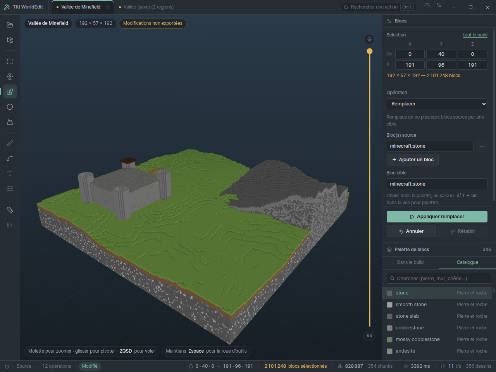

*À droite, le catalogue et ses familles ; à gauche dans le panneau,
« Remplacer » avec sa liste de blocs source — le champ qui n'existait pas.*

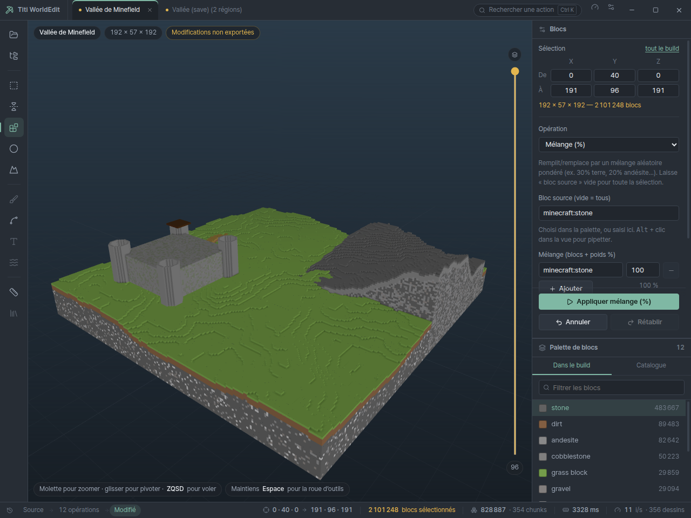

*« Mélange (%) » : une ligne par bloc, les parts en pourcentage sous la liste, et
le bouton d'application épinglé en bas du panneau.*

---

## Ce que les captures ont montré

Trois défauts d'interface que seul un vrai lancement révèle, trouvés en
regardant les images rendues après coup.

**Une opération qui n'appartenait pas à l'outil affiché.** L'état de départ
était `tool: 'select'` et `operation: 'set'`, deux constantes indépendantes.
Tant que l'outil de sélection n'avait aucune opération, la liste était cachée et
l'incohérence ne se voyait pas. En lui donnant le presse-papier, la capture a
montré « Copier » dans la liste, « Remplit la sélection d'un bloc » en
description et « Appliquer remplir » sur le bouton — et c'est `set` qui serait
parti au moteur. L'inspecteur retombe maintenant sur la première opération de
l'outil, et un test exige que l'état de départ soit cohérent.

**Le bouton principal sous la ligne de flottaison.** Le formulaire d'une
opération grandit avec ses paramètres : « Mélange » ajoute une ligne par bloc, et
« Appliquer » sortait de l'écran. Les actions sont épinglées en bas du panneau.
Un bouton principal qu'il faut aller chercher en défilant n'en est pas un.

**Un outil qui montre les commandes d'un autre.** « Texte et carte »,
« Relief » et « Bibliothèque » n'ont pas d'opérations du moteur — leur écran
reste à écrire. L'inspecteur gardait alors la description, les champs et le
bouton de l'opération précédente : choisir « Texte et carte » proposait
« Appliquer copier ». Chacun dit maintenant ce qu'il fera et ce qui manque
(`TOOL_NOTES`), et le rail les marque comme le fait l'inspecteur — un test
compare les deux, parce que deux affichages de la même vérité finissent par
diverger.

Pour que ces vérifications soient reproductibles, le mode capture accepte
`TITI_SCREENSHOT_TOOL` (une lettre de raccourci, la vraie) et
`TITI_SCREENSHOT_OP` / `TITI_SCREENSHOT_CLICK` (le vrai `<select>`, le vrai
bouton). Ce qu'on capture reste un état atteignable à la main.

---

## Les trois écrans qui manquaient

« Texte et carte », « Relief » et « Bibliothèque » étaient marqués « à venir » :
le moteur savait faire, l'écran manquait. Les voici.

### Le partage du travail

Les trois ont la même forme. L'interface prépare une **grille** — un masque
d'encre, des noms de blocs, des hauteurs — et le moteur l'écrit. Le découpage
n'est pas arbitraire :

| Qui | Quoi | Pourquoi lui |
|---|---|---|
| Moteur | la police embarquée, la palette de couleurs de carte | le rendu doit être le même partout, et la palette est une donnée du jeu |
| Renderer | rasteriser un SVG, décoder un PNG, échantillonner | c'est un navigateur : il le fait sans une ligne de code |
| Moteur | écrire les blocs | lui seul touche aux fichiers de région |

Le renderer ne lit toujours pas le disque : les octets d'image lui arrivent du
processus principal (`openImage`), et le PNG qu'il produit repart par lui
(`savePng`). L'invariant n° 6 tient.

La partie qui décide — quel bloc pour quelle couleur, quelle hauteur pour quel
gris — est dans `grid/pixels.js`, sans aucune dépendance au DOM, donc testable
sans navigateur. Ce qui touche un canvas est dans `draw.js`, et n'a pas de
décision à prendre.

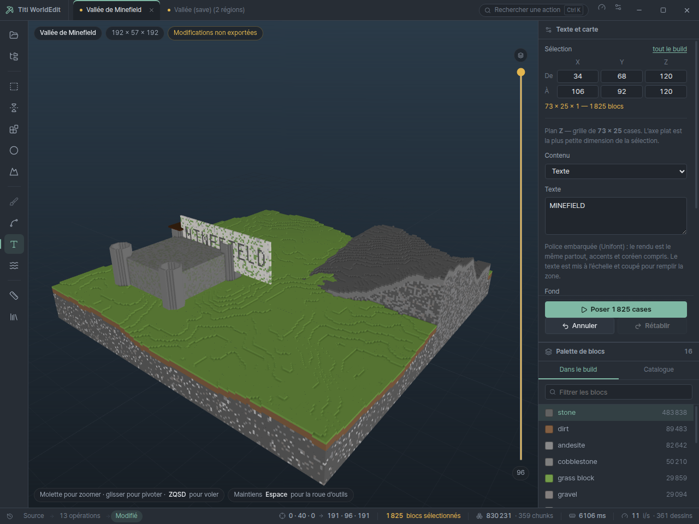

*Le texte part de la police embarquée du moteur, traverse un canvas du renderer
et revient en 1 825 blocs sur un mur de marbre. Capture prise en pilotant la
vraie interface : sélection tapée dans les six champs, outil choisi par son
raccourci, bouton cliqué.*

### Deux moitiés justes, une jonction fausse

`toHeights` rendait des hauteurs **en blocs**. `applyHeightmap` attend un
**rapport 0..1** et fait `clamp01(h) * maxH`. Chaque moitié passait ses tests.
Ensemble, toute cellule non nulle devenait 1 :

```
attendu   un dégradé diagonal, 0 → 32 blocs
obtenu    un plateau plat au sommet de la sélection
mesuré    1 022 cellules fausses sur 1 024, jusqu'à 31 blocs d'écart
```

Rien ne l'aurait signalé — pas d'exception, pas de message, juste un relief qui
n'est pas celui qu'on a demandé. C'est l'aller-retour qui l'a trouvé : sculpter
depuis une image, ressortir le relief, comparer. Il est maintenant un test
permanent (`test/grid-roundtrip.test.js`), avec ses équivalents pour le masque
du panneau et le damier de la carte — une unité qui traverse une frontière se
vérifie **en traversant**.

### Une épaisseur qui ne se voyait pas

Un panneau est estampé sur toute la profondeur de son axe plat. Sur une
sélection cubique de 192 × 57 × 192, « poser un panneau » a écrit **1 647 870
blocs** — le comportement voulu, mais rien à l'écran ne le disait. L'outil
annonce désormais l'épaisseur et le total, et conseille d'aplatir la sélection.

### Un moteur mort, une application muette

En branchant tout ça, un import fautif — `flatBlockColors` vit dans `./colors`,
pas dans `./worldedit` — a fait sortir l'`utilityProcess` dès son chargement. Le
processus principal attendait `engine.whenReady` avant d'ouvrir la fenêtre :

```
pas de fenêtre · pas de message · pas de fin
```

L'application restait en vie, indéfiniment, sans rien afficher. Le seul indice
était la trace du fils, noyée dans les avertissements de Chromium.
`whenReady` peut maintenant **échouer** — un moteur qui meurt avant d'avoir dit
« prêt » rejette la promesse —, et le principal ouvre un dialogue d'erreur au
lieu de rester suspendu. Le mode capture a gagné le même filet : une capture qui
n'aboutit pas sort en erreur au lieu de pendre.

### Piloter l'interface pour la vérifier

Le mode capture sait maintenant poser une sélection (`TITI_SCREENSHOT_SELECTION`),
choisir un outil, choisir une opération et cliquer un bouton — toujours par le
vrai chemin. Écrire ce pilotage a révélé un piège de React :
`dispatchEvent(new Event('blur'))` n'appelle **pas** le `onBlur` d'un composant,
parce que React écoute `focusout`, qui remonte, alors que `blur` ne remonte pas.
Il faut `focus()` puis `blur()` pour de vrai. Le symptôme, côté utilisateur d'un
script d'automatisation, serait « le champ ne marche pas ».

---

## Renommer un onglet sans rien perdre

Un build s'appelle « Build » jusqu'à ce qu'on le renomme, et jusqu'ici on ne
pouvait pas. Double-clic sur l'onglet, `Entrée` valide, `Échap` annule.

### Pourquoi c'est sans danger

Le dossier d'un projet porte son **identifiant**, jamais son nom :

```
<données>/projects/demo-vallee/     ← l'id, validé, jamais dérivé du nom
  ├─ project.json   { "name": "Arène N°3 — 한국", … }
  ├─ staging/regions/…              ← le travail
  └─ audit.jsonl
```

Renommer réécrit un champ de `project.json` et rien d'autre : pas un fichier
déplacé, pas un chemin de staging cassé, pas une pile d'annulation perdue. Un
test fige la propriété — régions, profondeur d'annulation, source et date de
création comparées avant et après. Si quelqu'un fait un jour dériver un chemin
du nom, il tombe dessus.

### Les lettres qui disparaissaient

C'est l'autre moitié, et celle qui abîmait vraiment quelque chose. La règle de
nom de fichier était `replace(/[^\w.-]+/g, '_')`. `\w` vaut `[A-Za-z0-9_]` :

```
« Vallée de Minefield »  →  Vall_e_de_Minefield
« Arène N°3 »            →  Ar_ne_N_3
« 한국어 건물 »            →  _
```

Le dernier cas est le pire : le nom entier est perdu, et deux builds coréens
différents sortent sous le même fichier. Absurde pour un moteur dont la police
embarquée couvre tout le BMP précisément pour qu'on puisse écrire du coréen.

`safeFileName` ne retire que ce qu'un système de fichiers refuse **vraiment** —
la liste de Windows, la plus stricte des trois plateformes :

| Ce qui part | Pourquoi |
|---|---|
| `< > : " / \ \| ? *` et les caractères de contrôle | refusés par Windows |
| `CON`, `PRN`, `NUL`, `COM1`…`LPT9`, extension comprise | noms de périphériques réservés |
| un point ou une espace en fin de nom | Windows les coupe en silence |
| toute suite de deux points | pour qu'aucun nom ne remonte d'un dossier |

Accents, CJK, emoji, tirets cadratins : gardés. Vérifié dans l'application, pas
seulement en test — un onglet renommé « Arène N°3 — 한국 » ressort en
`Arène N°3 — 한국.schem`, avec ses treize niveaux d'annulation intacts.

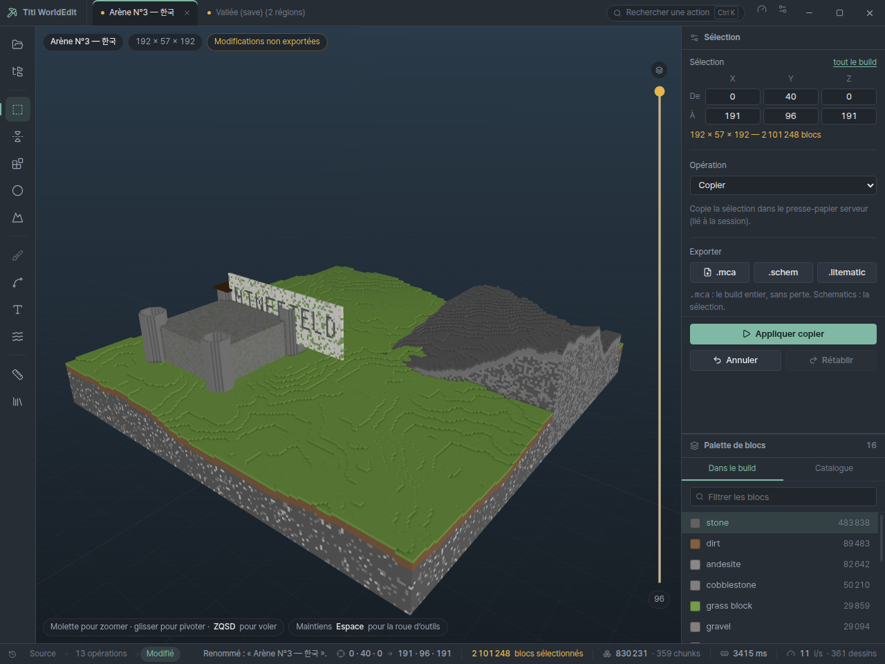

*Le nom custom tient dans l'onglet, dans la vignette du viewport et jusqu'au nom
de fichier proposé à l'export. Le build, lui, n'a pas bougé d'un bloc.*

Un cas garde délibérément son nom : une région seule exportée en `.mca` sort en
`r.X.Z.mca`, parce que c'est ce nom-là qui la rend relisible par le jeu. L'écran
d'export le dit, sans quoi c'est une surprise.

---

## Les icônes de blocs, formes comprises

La palette montrait un carré de couleur par bloc. Utile pour distinguer, pas
pour reconnaître : trente nuances de gris ne disent pas lequel est du
cobblestone.

### D'où viennent les textures

Pas de ce dépôt — les assets du jeu ne peuvent pas y être redistribués.
L'application lit le pack qu'on lui **désigne** dans les réglages : le `.jar`
d'une version de Minecraft, un pack de ressources zippé, ou un dossier déplié.
Le pack du serveur Minefield fournit de la même façon les blocs
`minefield:*` — y compris leur forme.

La chaîne suivie est celle du jeu, en entier :

```
assets/<ns>/blockstates/<nom>.json   quel modèle pour quel état
assets/<ns>/models/block/<x>.json    parent, textures, elements (les cuboïdes)
assets/<ns>/textures/block/<y>.png   l'image
```

On ne peut pas sauter directement au nom de texture. `grass_block` n'en a
aucune qui porte son nom (c'est `grass_block_top`, `dirt`, `grass_block_side`),
et surtout un bloc peut n'être pas un cube.

Un `.jar` pèse une vingtaine de mégaoctets pour plusieurs milliers d'entrées.
Le catalogue ZIP est indexé une fois ; chaque entrée n'est décompressée qu'à la
demande, et la palette — virtualisée — ne demande que la vingtaine de lignes
qu'elle affiche.

### Le cas qui interdit la solution facile

Tous les blocs ne sont pas des cubes. Une **chaise** `minefield:*`, un escalier,
une dalle, un quart de bloc. Plaquer leur texture sur un carré plein donne une
icône qui **ment sur ce qu'on pose**.

`planIcone` classe donc le modèle (`cube` ou `model`) et rend ses cuboïdes ;
l'icône les dessine un par un en projection isométrique, chaque face peinte par
une transformation affine — une face projetée est toujours un parallélogramme,
donc l'image d'un carré, et `setTransform` suffit sans découper en triangles.

Deux détails qui ne se voient qu'une fois faux :

- **Le tri en profondeur.** Sans lui, un pied de chaise se dessine par-dessus
  l'assise.
- **Le cadrage sur les bornes réelles.** Minecraft autorise des éléments de −16
  à 32, et le dossier d'une chaise monte à 20 : cadrer sur 0..16 le rognait. À
  l'inverse, une dalle cadrée sur 16 se dessinerait en trait dans un coin — là,
  elle remplit son icône.

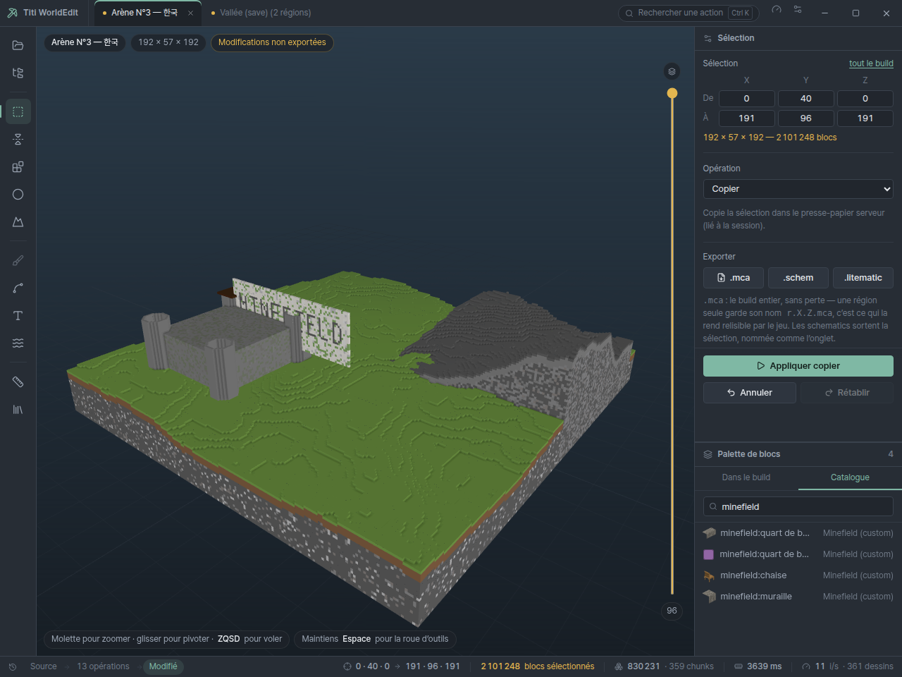

*Un quart de bloc, une chaise et une muraille, dessinés depuis leurs modèles.
Le deuxième `quart de bloc` n'est pas dans ce pack : il retombe sur son carré
de couleur — un repli assumé, pas un trou.*

### Le pack déclare aussi CE QUI EXISTE

Un pack contient un fichier de blockstate par bloc. C'est la liste de référence,
`minefield:*` compris — et c'est ce qui règle le problème que ce dépôt ne peut
pas régler seul : **désigner le pack du serveur remplit le catalogue**, sans que
personne ait à recopier une liste d'identifiants ici. Les trois sources se
complètent, de la plus sûre à la plus opportuniste : la palette vanilla écrite
dans le code, le pack, puis les blocs croisés dans les builds ouverts.

Un bloc absent du pack ne reçoit **pas** d'icône approchée : il garde son carré
de couleur. Une icône fausse est pire qu'un carré, parce qu'on la croit.

Pour essayer tout ça sans installer Minecraft :
`npm run pack --workspace @titi/desktop -- <dossier>` fabrique un pack de
démonstration — textures générées, vraie arborescence, et une chaise en six
cuboïdes.

---

## Raccourcis réassignables

Les touches vivaient à deux endroits : la lettre de chaque outil dans `TOOLS`,
les combinaisons dans le gestionnaire de `App.jsx`. Rien de configurable, et
rien qui empêchait deux actions de partager une touche. C'est la deuxième fois
de la journée que deux constantes indépendantes divergent.

`keys.js` est maintenant la seule table — pur, sans DOM, donc testable. Une
liaison a une **forme canonique unique** : les modificateurs dans un ordre fixe,
puis la touche (`Ctrl+Shift+Z`). C'est ce qui permet de comparer deux liaisons
par égalité de chaînes, donc que la détection de conflit, la persistance et
l'affichage n'aient pas chacun leur idée de la normalisation.

Le test qui compte porte sur les modificateurs **absents** :

```
« Z »        répond à z          … et PAS à Ctrl+Z
« Ctrl+Z »   répond à Ctrl+Z     … et PAS à Ctrl+Maj+Z
```

Sans ça, une annulation change d'outil au passage.

Deux choix assumés :

- **Ce qui est illisible est refusé, pas rafistolé.** Une liaison approximative
  est une touche qui ne répond pas — plus déroutant qu'un retour au défaut. Un
  `settings.json` bricolé à la main ne peut pas rendre l'application
  inutilisable au clavier.
- **Les conflits sont signalés, pas empêchés.** Réassigner passe forcément par
  un état où deux actions partagent une touche ; obliger à libérer d'abord est
  une gymnastique que personne ne fait.

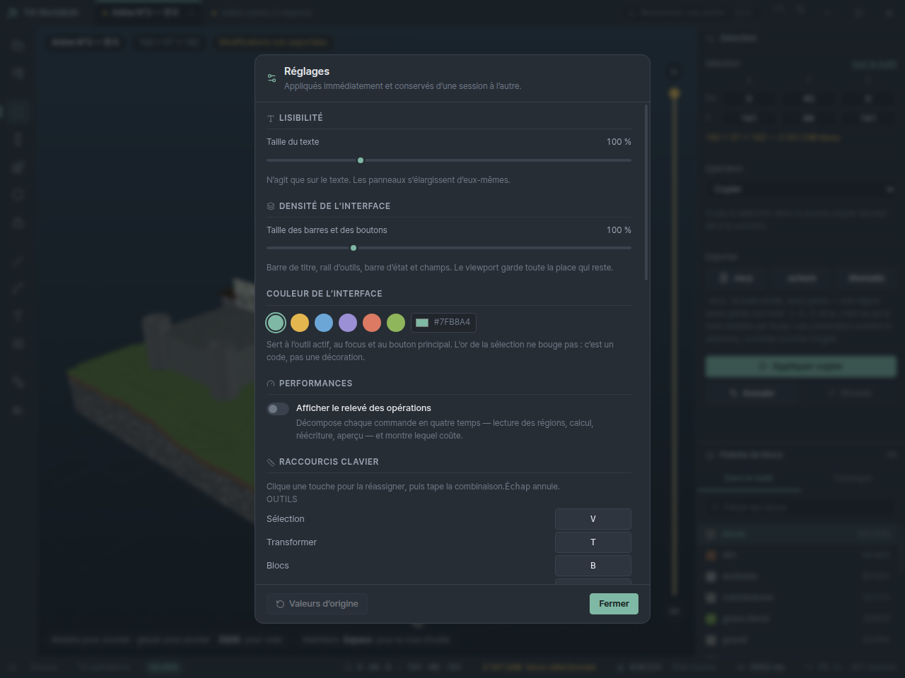

Le rail affiche la liaison **effective** : une lettre par défaut affichée après
réassignation annoncerait un raccourci qui ne marche pas.

---

## Rejouabilité des tirages aléatoires

L'invariant n° 4 veut que toute génération aléatoire soit rejouable à seed
égale. Deux endroits ne le respectaient pas : `opMix` et `fillerPicker`
(la roche profonde de `naturalize` et `terrain`) appelaient `Math.random()`.
Deux exécutions de `make-demo.js` avec la même seed ne rendaient donc pas le
même build — « Massif rocheux » sortait à 105 369 puis 105 385 blocs.

Le défaut est venu du relevé de performance : en comparant deux exécutions pour
mesurer un gain, les compteurs de blocs ne tombaient pas juste.

### Un hash de position, pas un générateur à état

Les deux tirages passent maintenant par `hash3(x, y, z, seed)`, du même
tonneau que le `hash2` qui sert déjà au bruit de relief. C'est un meilleur
choix qu'un générateur à état pour ce travail :

- **il ne dépend pas de l'ordre de parcours.** Un générateur à état ne rejoue
  identique que si la boucle visite les cases dans le même ordre — une
  contrainte invisible qu'une optimisation future casserait sans bruit ;
- **il est stable par morceaux.** Mélanger un cube entier, puis remélanger un
  coin de ce cube avec la même seed, redonne exactement les mêmes blocs dans ce
  coin. Un test l'exige.

La roche profonde décale sa graine (`seed + 9176`) : sans ça, elle partagerait
sa graine avec le bruit de relief et son motif pourrait épouser celui des
collines.

`mix` et `naturalize` gagnent un paramètre `seed`, comme `terrain` en avait
déjà un.

### Le piège : un normaliseur qui jette en silence

`normalizeParams` (`worldedit/operations.js`) ne garde que les paramètres qu'il
nomme explicitement — et pour `naturalize`, le cas non personnalisé faisait
`return { preset }`. Ajouter `seed` au descripteur et à l'opération n'aurait
donc **rien changé** : la graine aurait été jetée entre les deux, sans erreur,
et le tirage serait resté non rejouable pendant qu'un champ « Graine » invitait
à le régler.

### Vérification

Deux exécutions de `make-demo.js` rendent désormais des compteurs identiques au
bloc près, palette dominante comprise. Côté tests, la rejouabilité se vérifie
sur la sélection ENTIÈRE et non sur un bloc — comparer un seul bloc passerait
par chance une fois sur N. Un test de distribution vérifie en plus que les
proportions tirées suivent les poids demandés à moins de 2 points : un hash mal
mélangé passerait les tests de rejouabilité et produirait quand même des bandes.

---

## Écarts assumés avec le moteur du site

| Sujet | Site | Ici | Pourquoi |
|---|---|---|---|
| Plafonds | variables d'environnement | options de `createStaging` | Une application de bureau doit pouvoir les relever selon la RAM de la machine (phase 1.2). |
| `regenPreview` | `deriveSparse` sans troncature | tronqué comme partout ailleurs | Sur le site, annuler une opération sur un très gros build levait `too_many_blocks` : l'annulation avait bien eu lieu sur disque, mais l'utilisateur voyait une erreur pour une opération réussie. |
| Forme des projets | ligne SQLite (`min_x`, `size_x`, `source_file`) | `{ id, name, min, size, source }` | Le moteur n'a pas à connaître le nom des colonnes d'une base qu'il n'utilise pas. |
| `regionCoordsFromName` | deux versions aux règles différentes | une seule, celle d'`anvil` | Celle du lecteur ZIP n'acceptait que `r.X.Z.mca` ; celle d'`anvil` accepte en plus `r_X_Z.mca`. Deux homonymes aux règles divergentes finissent toujours par se rencontrer au mauvais moment. |
| Ids de projet | entiers de la base | validés `[A-Za-z0-9_-]{1,64}` | Assainir au lieu de valider fait collisionner deux ids distincts sur le même dossier, donc perdre un projet en silence. |

---

## Limites connues, non encore traitées


- **Les entités mobiles** (`entities/r.X.Z.mca` : villageois, cadres, armor
  stands) ne sont ni lues ni écrites, et l'export `.schem` sort une liste
  `Entities` vide. Les block entities, elles, sont portées — voir plus bas.
- **`getBlock` alloue un objet par appel** (`{ Name, Properties }`). Le reste du
  chemin chaud est traité (voir « Le chemin chaud du `RegionStore` »).
- **Le parallélisme ne couvre que deux opérations** (`terrain`, `naturalize`).
  Les autres restent sur un seul fil — voir « Le pool de fils ».
- **L'aperçu se resérialise en entier** à chaque opération, même pour un bloc
  changé. Le format binaire a ramené ce plancher de ~330 ms à ~30 ms ; le
  supprimer demanderait un aperçu découpé par chunk, donc de toucher aussi le
  renderer.
- **Pas de textures ni de modèles non cubiques** dans le viewport (phase 2.5),
  détaillé plus bas.

### Ce que le viewport ne fait pas encore

- **Pas de textures** : chaque bloc est teinté d'une couleur unie. La base vient
  des vraies couleurs de carte du jeu, exportées par le moteur
  (`flatBlockColors`, ~60 blocs) ; le reste est complété à la main, et un bloc
  inconnu reçoit une teinte dérivée de son nom, stable mais arbitraire. L'atlas
  arrive en phase 2.5.
- **Pas de modèles non cubiques** : escaliers, dalles et quarts de bloc
  `minefield:*` sont rendus en cube plein. C'est la vraie limite du greedy
  meshing, et le gros du travail de la 2.5.
- **Pas de sélection à la souris ni de gizmos** : elle se saisit en chiffres
  dans l'inspecteur, six nombres comme ceux du F3. Phase 2.5.
- **Pas de palette de commandes** (`Ctrl+K`), pas de thème clair, pas d'onglets
  multiples réellement ouvrables.

### Mesurer le viewport honnêtement

Les captures et les chiffres de cette documentation sont produits sous
**xvfb + SwiftShader**, c'est-à-dire un rendu 100 % logiciel sur une machine
sans carte graphique. Les 8 images par seconde qu'affiche la barre d'état dans
ces conditions ne disent RIEN des performances réelles : elles mesurent un
rasteriseur logiciel, pas le viewport. Le seul chiffre transposable de ces
captures est le nombre d'appels de dessin (385 pour 850 000 blocs, soit un par
chunk), qui est une propriété du maillage et pas du matériel.

La cible de 60 images par seconde sur 20 M de blocs se vérifiera sur une vraie
machine, à la phase 2.7.

### Phase 1.1 : la mesure a contredit l'intuition

J'avais annoncé que `prismarine-nbt` dominerait le chargement d'une région et
qu'il faudrait sans doute le remplacer. **C'était faux.** Le bench a montré :

| Étape | Avant | Part |
|---|---|---|
| inflate | 101 ms | 3 % |
| `nbt.parse` | 346 ms | 11 % |
| `nbt.simplify` | 41 ms | 1 % |
| `readSection` | 2585 ms | **85 %** |

Le coût était dans notre propre code : `decodeBlockStates` allouait **un BigInt
par bloc** pour extraire un index de palette. Une région pleine, c'est 12 288
sections × 4096 blocs.

Le format 1.16+ ne fait jamais chevaucher un index sur deux longs et un index
tient sur 12 bits au plus : tout se lit en arithmétique 32 bits. Résultat
mesuré, médiane de 3 :

- dépack de sections : **× 10,7**
- chargement d'une région complète : **× 4,2** (3502 → 841 ms)

La réécriture est jugée par `test/section-unpack.test.js`, qui compare sa sortie
à l'implémentation BigInt d'origine sur les onze largeurs de palette. Une
manipulation de bits ne se relit pas, elle se compare.

Maintenant que le dépack ne coûte plus rien, le NBT est effectivement devenu le
premier poste (50 % du chargement) — mais c'est la mesure qui l'a établi, pas
l'intuition, et l'ordre des deux n'est pas un détail : remplacer le NBT d'abord
aurait été optimiser 12 % en laissant 85 %.

### Le seuil de régression en intégration continue

Le cahier des charges demande de signaler une régression de plus de 20 %.
Mesuré ici : à **code identique**, `mirror-rotate` est passé de 9,3 s à 11,0 s
entre deux exécutions — 18 % d'écart pour rien. Un seuil à 20 % sur une machine
partagée déclenche sur du bruit, et une garde qui crie au loup finit désactivée.

Le lanceur prend donc la **médiane** de N exécutions (`--repeat=3`) et n'annonce
un écart qu'au-delà de 25 %.

---

## Rapport au site

Le moteur est ici, `titisite` garde le sien. Les deux vont diverger dès que la
phase 1 réécrira `RegionStore` et ajoutera les entités.

Le `StorageAdapter` existe précisément pour que ce ne soit pas irréversible : le
jour où on veut rebrancher le site sur ce package, il ne reste qu'à écrire un
`SqliteUploadsAdapter` (une centaine de lignes : les mêmes méthodes, contre la
base et `uploads/`) et à le faire passer la suite de contrat déjà écrite. Rien
d'autre dans le moteur n'a besoin de bouger.

---

## Commandes

```bash
npm install
npm test                              # tous les paquets
npm run lint

# Application
npm run dev      --workspace @titi/desktop   # Vite + Electron en parallèle
npm run start    --workspace @titi/desktop   # build puis lancement
npm run dist     --workspace @titi/desktop   # installeur NSIS + portable (Windows)
npm run demo     --workspace @titi/desktop -- <dossier-de-données>
npm run pack     --workspace @titi/desktop -- <dossier>   # pack de ressources de démo

# Capture du rendu, y compris sans écran (rendu logiciel)
TITI_SCREENSHOT=/chemin/capture.png xvfb-run -a npx electron .
```

Cinq variables préparent l'état avant la prise, toutes par le **vrai** chemin de
l'interface et non par un crochet de test — ce qu'on capture est donc un état
atteignable à la main, pas un état forcé qui pourrait mentir :

| Variable | Effet | Chemin emprunté |
|---|---|---|
| `TITI_SCREENSHOT_WHEEL=1` | ouvre la roue d'outils | touche `Espace` |
| `TITI_SCREENSHOT_SETTINGS=1` | ouvre les réglages | `Ctrl` `,` |
| `TITI_SCREENSHOT_TOOL=B` | choisit un outil | sa lettre de raccourci |
| `TITI_SCREENSHOT_SELECTION=x0,y0,z0,x1,y1,z1` | pose une sélection | les six champs, `focus()` puis `blur()` |
| `TITI_SCREENSHOT_OP=mix` | choisit une opération | le vrai `<select>`, vrai `change` |
| `TITI_SCREENSHOT_CLICK=<sélecteur>` | clique un élément | `.click()` sur le vrai bouton |
| `TITI_SCREENSHOT_DBLCLICK=<sélecteur>` | double-clique un élément | un vrai `dblclick` (renommage d'onglet) |
| `TITI_SCREENSHOT_FILL=<sélecteur>\|<valeur>` | remplit un champ | le `value` natif puis un vrai `input` |
| `TITI_SCREENSHOT_TYPE=<texte>` | tape puis valide | de vrais événements `char`, puis `Entrée` |
| `TITI_SCREENSHOT_CLICK_WAIT=20000` | attend après le clic | un clic peut lancer une opération longue |

Une capture qui n'aboutit pas **échoue** au lieu de pendre : un filet sort en
erreur passé le délai plus trente secondes.

`TITI_SCREENSHOT_DELAY` règle l'attente avant la prise (9 000 ms par défaut).

`TITI_DATA_ROOT` déplace l'espace de données (par défaut
`%APPDATA%/TitiWorldEdit`), ce qui permet de travailler sur un jeu de projets
jetable sans toucher au vrai.

---

## État des phases

| Phase | Sujet | État |
|---|---|---|
| 0 | Extraire le moteur en package partagé | **fait** |
| 2.1 | Socle Electron (3 processus, `app://`, IPC en liste blanche) | **fait** |
| 2.2 | Ouverture et export | **fait** — `.mca`, `.zip`, dossier de save, dossier `region/`, `.schem`, `.litematic`, glisser-déposer ; export `.mca`/`.schem`/`.litematic` ; « Appliquer au monde » avec verrou `session.lock` et sauvegarde horodatée. Reste : récupération après crash explicite (le staging est déjà persistant) |
| 2.3 | Direction visuelle (jetons, Pretendard, roue d'outils) | **fait** |
| 2.4 | Disposition (panneaux, inspecteur généré, palette virtualisée) | fait pour l'essentiel ; `Ctrl+K` et thème clair à venir |
| 2.4f | Icônes de blocs et raccourcis réassignables | **fait** — pack de ressources (`.jar`, zip ou dossier), modèles non cubiques dessinés par cuboïdes, catalogue rempli par le pack ; table de raccourcis unique et réassignable |
| 2.4e | Renommer un projet | **fait** — double-clic sur l'onglet ; les lettres custom survivent jusqu'au nom de fichier exporté |
| 2.4d | Écrans « Texte et carte », « Relief », « Bibliothèque » | **fait** — texte par la police embarquée, image en couleurs ou en silhouette, relief à l'aller et au retour, rangement et reprise par le presse-papier du moteur |
| 2.4c | Commandes complètes et catalogue de blocs | **fait** — les 29 opérations atteignables, champs `blocklist`/`pattern`/`mask`, presse-papier et biome branchés, raccourcis d'outil, catalogue de 346 blocs + `blocks.json` pour les `minefield:*`. Reste : les écrans « Texte et carte », « Relief » et « Bibliothèque », dont le moteur est prêt |
| 2.4b | Réglages (texte, densité, accent) + mode performance | **fait** — `settings.json` via l'adapter, `theme.js` testé, relevé par phase |
| 2.5 | Viewport | maillage par chunk + AO **fait** ; atlas de textures et modèles non cubiques à venir |
| 2.6 | Empaquetage | **fait** — installeur NSIS et portable construits sur Windows, paquet Linux construit et lancé. Reste : signature de code (certificat à acheter) |
| 1.1 | Mesurer | **fait** — `bench/`, 16 scénarios, `RESULTS.md` |
| 1.2 | Moteur rapide | **fait** — dépack de sections × 10,7, `RegionStore` (set-10M × 6,7), aperçu binaire et incrémental × 11,1 (−82 % sur le total), pool de fils × 2,4 sur `terrain`, plafonds réglables. Reste : aperçu découpé par chunk, `getBlock` sans allocation |
| 1.3 | Entités | block entities **faites** (portées par les opérations et l'export décalé, biomes compris) ; entités mobiles (`entities/*.mca`) à venir |
| 3 | Brushs | à venir |
| 4 | Tracés, PNJ, dispersion | à venir |
| 5 | Outils de génération | à venir |

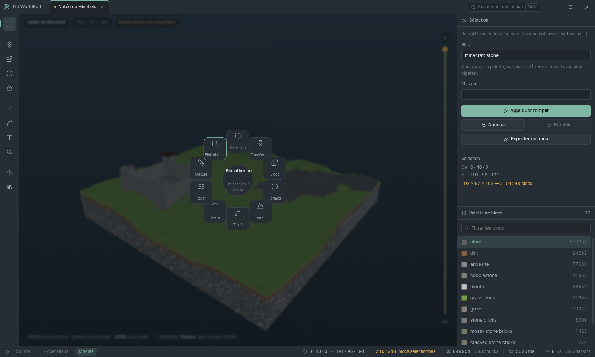

*L'élément signature : maintenir `Espace` au-dessus du viewport ouvre la roue,
la direction du curseur choisit l'outil, relâcher valide. On change d'outil sans
quitter le build des yeux.*

L'ordre choisi n'est pas celui du numérotage : le socle Electron passe **avant**
l'optimisation du moteur, pour que le bench de la phase 1 mesure les vrais
chemins chauds de l'application au lieu de cibles supposées, et pour qu'il y ait
un exécutable à essayer tôt.
